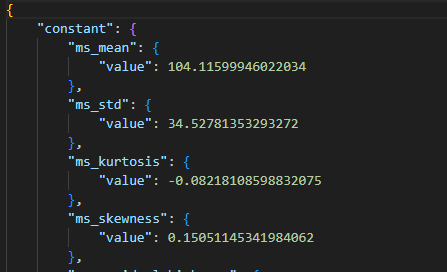
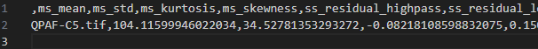

# ウェーブレット特徴量データセットテンプレート

## 概要

材料観察画像（SEM/TEM像や相の分布画像）などパターン画像（模様やテクスチャなど）に対して、ウェーブレット変換のひとつであるSteerable Pyramids手法によりマルチスケールな特徴や構造の抽出を行えます。

## カタログ番号

- DT0013

## 登録データについて

本データセットテンプレートで作成したデータセットには、`TIFF形式の画像ファイル`と、そこから抽出したウェーブレット特徴量をCSV形式の`ウェーブレット特徴量ファイル`として、さらに、PNG形式に変換した`可視化ファイル`を登録することができます。なお、TIFF形式の画像ファイルは１つ登録する必要があります。

### TIFF形式の画像ファイル

拡張子は、.tif と .tiff のみ入力可能です。ファイル命名規則はありません。

### ウェーブレット特徴量ファイル・可視化ファイル

RDE閲覧アプリケーションではTIFF形式の画像を表示することができないため、png形式に変換した可視化ファイルを自動的に作成し、登録します。

| ファイル名 | 内容 |備考|
|:----|:----|:----|
|metadata.json|主要パラメータメタ情報ファイル|<br>入力されたTIFF形式の画像ファイルから抽出したウェーブレット特徴量をjson形式にしたもの（[こちら](#抽出メタ)を参照）|
|\*.csv|ウェーブレット特徴量ファイル|<br>入力されたTIFF形式の画像から抽出したウェーブレット特徴量をCSV形式にしたもの、metadata.jsonと同じ内容|
|\*.png|可視化ファイル|入力されたTIFF形式の画像をpng形式に変換したもの|

### メタ情報

次のように、大きく４つに分類されます。

- 基本情報
- 固有情報
- 抽出メタ情報

#### 基本情報

基本情報はすべてのデータセットテンプレート共通のメタです。詳細は[データセット閲覧 RDE Dataset Viewer > マニュアル](https://dice.nims.go.jp/services/RDE/RDE_manual.pdf)を参照してください。

#### 固有情報

固有情報はデータセットテンプレート特有のメタです。以下は本データセットテンプレートに設定されている固有メタ情報項目です。

|項目名|必須|日本語語彙|英語語彙|単位|初期値|データ型|フォーマット|備考|
|:----|:----|:----|:----|:----|:----|:----|:----|:----|
|key1||キー1|key1|||string||汎用項目|
|key2||キー2|key2|||string||汎用項目|
|key3||キー3|key3|||string||汎用項目|
|key4||キー4|key4|||string||汎用項目|
|key5||キー5|key5|||string||汎用項目|
|common_data_type||登録データタイプ|Data type||XPS|string|||
|common_data_origin||データの起源|Data Origin||experiments|string|||
|common_technical_category||技術カテゴリー|Technical Category||measurement|string|||
|common_reference||参考文献|Reference|||string|||||calculation_calculation_method||計算方法 |Calculation method ||wavelet characterization |string|||
|calculation_supercom_or_pc||SuperComまたはPC |SuperCom or PC ||azure cloud |string|||
|calculation_os||オペレーティングシステム |OS||canonical 0001-com-ubuntu-server-focal 20_04-lts |string|||
|calculation_software_name||ソフトウェア名称 |Software name ||wavelet characterization |string|||
|calculation_software_version||ソフトウェアバージョン |Software version |||string|||
|calculation_software_reference||ソフトウェア参照 |Software reference |||string|||
|calculation_operator||計算実行者 |Operator ||RDE |string|||
|calculation_calculated_date||計算日 |Calculated date |||string[date]|YYYY-MM-DD|登録日から自動取得します |
|calculation_material_name||物質名 |Material name|||string|||
|calculation_key_object||キーの配列/計算される主な物性 |Key object |||string|||

#### 抽出メタ

抽出メタ情報は、TIFF形式画像ファイルから構造化処理で抽出したウェーブレット特徴量メタデータです。以下は本データセットテンプレートに設定されている抽出メタ情報項目です。

|項目名|日本語語彙|英語語彙|単位|データ型|備考|
|:----|:----|:----|:----|:----|:----|
|brightness_mean|輝度平均 |Brightness Mean ||number||
|brightness_standard_deviation|輝度標準偏差 |Brightness Standard Deviation ||number||
|brightness_skewness|輝度歪度 |Brightness Skewness ||number||
|brightness_kurtosis|輝度尖度 |Brightness Kurtosis ||number||
|highpass_filter_feature|ハイパスフィルター特徴量 |Highpass Filter Feature ||number||
|lowpass_filter_feature|ローパスフィルター特徴量 |Lowpass Filter Feature ||number||
|scale-0_spectrum_statistics|スケール0のスペクトル統計量 |Scale-0 Spectrum Statistics ||number||
|scale-1_spectrum_statistics|スケール1のスペクトル統計量 |Scale-1 Spectrum Statistics ||number||
|scale-2_spectrum_statistics|スケール2のスペクトル統計量 |Scale-2 Spectrum Statistics ||number||
|scale-3_spectrum_statistics|スケール3のスペクトル統計量 |Scale-3 Spectrum Statistics ||number||
|scale-4_spectrum_statistics|スケール4のスペクトル統計量 |Scale-4 Spectrum Statistics ||number||
|scale-0_spectrum_statistics|スケール0のスペクトル統計量 |Scale-0 Spectrum Statistics ||number||

## データカタログ項目

データカタログの項目です。データカタログはデータセット管理者がデータセットの内容を第三者に説明するためのスペースです。

|RDE用パラメータ名|日本語語彙|英語語彙|データ型|備考|
|:----|:----|:----|:----|:----|
|dataset_title|データセット名|Dataset Title|string||
|abstract|概要|Abstract|string||
|data_creator|作成者|Data Creator|string||
|language|言語|Language|string||
|experimental_apparatus|使用装置|Experimental Apparatus|string||
|data_distribution|データの再配布|Data Distribution|string||
|raw_data_type|データの種類|Raw Data Type|string||
|stored_data|格納データ|Stored Data|string||
|remarks|備考|Remarks|string||
|references|参考論文|References|string||
|key1|キー1|key1|string|送り状メタkey1の説明|
|key2|キー2|key2|string|送り状メタkey2の説明|
|key3|キー3|key3|string|送り状メタkey3の説明|
|key4|キー4|key4|string|送り状メタkey4の説明|
|key5|キー5|key5|string|送り状メタkey5の説明|

## 構造化処理の詳細

### 設定ファイルの説明

構造化処理を行う際の、設定ファイル(`rdeconfig.yaml`)の項目についての説明です。

| 階層 | 項目名 | 語彙 | データ型 | 標準設定値 | 備考 |
|:----|:----|:----|:----|:----|:----|
| system | extended_mode | 動作モード | string | (なし) | 計測データファイル一括投入時'MultiDataTile'を設定。 |
| system | save_raw | 入力ファイル公開・非公開  | string | false | 公開したい場合は'true'に設定。 |
| system | magic_variable | マジックネーム | string | true | TIFF形式画像ファイル名 = データ名としない場合は'false'に設定。 |
| system | save_thumbnail_image | サムネイル画像保存  | string | true | |

### dataset関数の説明

XPSが出力するデータを使用した構造化処理を行います。以下関数内で行っている処理の説明です。

```python
def dataset(srcpaths: RdeInputDirPaths, resource_paths: RdeOutputResourcePath) -> None:
    """Execute structured processing in Wavelet-transform.

    It handles structured text processing, metadata extraction, and visualization.
    Other processing required for structuring may be implemented as needed.

    Args:
        srcpaths (RdeInputDirPaths): Paths to input resources for processing.
        resource_paths (RdeOutputResourcePath): Paths to output resources for saving results.

    Returns:
        None

    Note:
        The actual function names and processing details may vary depending on the project.

    """
```

### TIFF形式画像ファイル(tif/tiffファイル)読み込み

- TIFF形式画像ファイルの拡張子の確認を行う。
```python
    # Check input File
    rawfile: Path = module.file_reader.validate(resource_paths.rawfiles)
```

### メタデータを抽出し、ウェーブレット特徴量ファイルに保存

- TIFF形式画像ファイルからウェーブレット特徴量を抽出し、ウェーブレット特徴量ファイル`<TIFF形式画像ファイル名>.csv`として保存する。
```python
    # Read the file, perform a wavelet transform, and extract the metadata
    meta: MetaType = module.file_reader.read(rawfile)

    # Save metadata as CSV format
    module.structured_processer.save_meta_to_csv(meta, rawfile.name, resource_paths.struct.joinpath(f"{rawfile.stem}.csv"))
```

### 可視化ファイルを作成し保存

- TIFF形式画像ファイルをPNG形式に変換したファイルを作成し、`<TIFF形式画像ファイル名>.png`として保存する。
```python
    # Convert from input tif file to png file
    module.structured_processer.to_png(rawfile, resource_paths.main_image.joinpath(f"{rawfile.stem}.png"))
```

### メタ情報ファイルに保存

- 抽出したウェーブレット特徴量を、メタ情報ファイル`metadata.json`として保存する。
```python
    # Parse and save meta
    module.meta_parser.parse(meta)
    module.meta_parser.save_meta(resource_paths.meta.joinpath("metadata.json"), Meta(srcpaths.tasksupport.joinpath("metadata-def.json")))
esource_paths.struct.joinpath(f"{rawfile.stem}.csv"))
```

### 送り状（invoice.json）の計算日を上書き

- 送り状（invoice.json）の計算日に何も記入しなかった場合、データ登録日を上書きする
```python
    # Overwrite invoice
    module.invoice_writer.overwrite_invoice_calculated_date(resource_paths)
```
